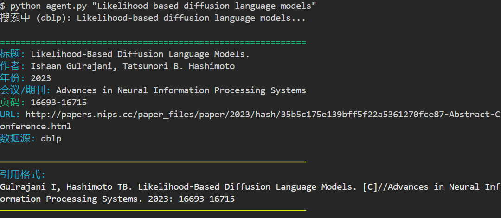
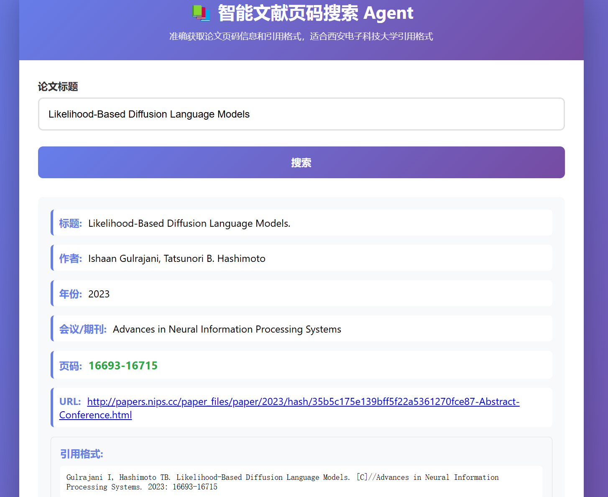

# 智能文献页码搜索 Agent

一个智能的学术文献页码搜索工具，用于准确获取论文的页码信息和格式化引用，适合西安电子科技大学的引用格式。

## 使用效果

### CLI



### Web



## 功能特性

- ✅ **多源搜索**：支持 DBLP、Google Scholar、CrossRef、PMLR 等多个学术数据库
- 📄 **智能页码提取**：从 BibTeX、DOI、API、PDF 元数据等多种来源自动提取页码
- 🤖 **LLM 增强提取**：支持使用大语言模型从网页内容中智能提取页码（可选）
- 📝 **引用格式生成**：自动生成标准化的学术引用格式（支持会议和期刊格式）
- 🏷️ **会议/期刊名称扩展**：自动将会议/期刊缩写转换为全名（如 ISSRE → IEEE International Symposium on Software Reliability Engineering）
- 💾 **智能缓存**：本地缓存已查询结果，提高查询效率
- 🎯 **高准确率**：直接从官方数据源获取，避免 AI 幻觉
- 🖥️ **多种界面**：支持命令行（CLI）、交互式模式和 Web 界面
- 🔄 **批量查询**：支持批量处理多篇文献
- 🔗 **DOI 支持**：通过 DOI 直接获取 BibTeX 格式的完整引用信息

## 支持的会议/期刊

支持 200+ 个常见会议和期刊的缩写自动扩展，包括但不限于：

**AI/ML 领域**：AAAI, ICML, NeurIPS, ICLR, IJCAI, AISTATS, UAI, COLT, ALT 等

**计算机视觉**：CVPR, ICCV, ECCV, BMVC, WACV 等

**自然语言处理**：ACL, EMNLP, NAACL, EACL, COLING, CoNLL, LREC 等

**软件工程**：ICSE, FSE, ASE, ISSTA, ICST, ICSME, MSR 等

**系统**：OSDI, SOSP, ASPLOS, MICRO, HPCA, ISCA, SIGCOMM, INFOCOM 等

**安全**：CCS, USENIX Security, NDSS, RAID, SP, ESORICS 等

**数据库**：VLDB, SIGMOD, ICDE, PODS, EDBT 等

以及其他在 DBLP、Google Scholar 和 CrossRef 收录的会议/期刊

## 安装

```bash
pip install -r requirements.txt
```

## 快速开始

### 命令行使用

```bash
# 搜索单篇论文（自动显示引用格式）
python agent.py "Likelihood-Based Diffusion Language Models"

# 交互式模式（持续对话，支持多条查询）
python agent.py --interactive
# 或直接运行
python agent.py

# 批量搜索
python agent.py --batch papers.txt

# 导出为 BibTeX 格式
python agent.py "BERT: Pre-training of Deep Bidirectional Transformers" --export bibtex

# 导出为 JSON 格式
python agent.py "GPT-3" --export json --output results.json

# 导出为 BibTeX 和 JSON 两种格式
python agent.py "Transformer" --export both

# 不使用缓存（强制重新搜索）
python agent.py "论文标题" --no-cache

# 查看缓存统计
python agent.py --stats

# 清除缓存
python agent.py --clear-cache
```

### Python API 使用

```python
from paper_agent import PaperAgent
from paper_agent.utils import format_citation_reference

agent = PaperAgent()
result = agent.search("Attention is All You Need")

if result:
    print(f"标题: {result['title']}")
    print(f"作者: {', '.join(result['authors'])}")
    print(f"年份: {result['year']}")
    print(f"会议/期刊: {result['venue']}")
    print(f"页码: {result['pages']}")
    print(f"DOI: {result.get('doi', 'N/A')}")
    
    # 生成引用格式
    citation = format_citation_reference(result)
    print(f"\n引用格式:\n{citation}")
```

**输出示例**：

```
标题: Attention is All You Need
作者: Ashish Vaswani, Noam Shazeer, Niki Parmar, ...
年份: 2017
会议/期刊: Advances in Neural Information Processing Systems
页码: 6000-6010

引用格式:
Vaswani A, Shazeer N, Parmar N, et al. Attention is All You Need. [C]//Advances in Neural Information Processing Systems. 2017: 6000-6010
```

### Web 界面

```bash
python web_app.py
```

然后访问 http://localhost:5000

## 引用格式说明

系统自动生成两种引用格式：

**会议论文格式**：
```
[编号] 作者1, 作者2, 作者3, et al. 论文标题. [C]//会议全名. 年份: 页码范围
```

**期刊论文格式**：
```
[编号] 作者1, 作者2, 作者3, et al. 论文标题. [J]. 期刊全名, 年份, 卷号(期号):页码范围
```

**特性**：
- 自动识别会议/期刊类型
- 超过3个作者时使用 "et al."
- 自动清理作者名中的数字后缀（如 "0003"）
- 支持卷期号提取和格式化
- 会议/期刊缩写自动扩展为全名

## 项目结构

```
paper_reference_agent/
├── agent.py                    # 命令行入口（支持交互式模式）
├── web_app.py                  # Web 界面入口
├── examples.py                 # 使用示例
├── paper_agent/                # 核心模块
│   ├── __init__.py
│   ├── searcher.py             # 搜索引擎（DBLP, Google Scholar, CrossRef, PMLR）
│   ├── extractors.py           # 页码提取器（BibTeX, DOI, PDF, LLM）
│   ├── llm_extractor.py        # LLM 增强提取器（支持 Selenium）
│   ├── neurips_extractor.py    # NeurIPS 特定提取器
│   ├── pmlr_searcher.py        # PMLR 搜索引擎
│   ├── google_scholar_searcher.py  # Google Scholar 搜索引擎
│   ├── cache.py                # 缓存管理
│   └── utils.py                # 工具函数（格式化、相似度计算、名称扩展等）
├── config.py                   # 基础配置文件
├── llm_config.py               # LLM 配置文件（可选）
├── llm_config.example.py       # LLM 配置示例
├── requirements.txt            # 依赖包
├── LLM_CONFIG.md               # LLM 配置说明文档
└── README.md                   # 项目说明文档
```

## 配置

### 基础配置

编辑 `config.py` 文件设置：
- API Keys（如需要 Semantic Scholar API）
- 缓存目录
- 超时设置
- 代理设置（如需要）

### LLM 配置（可选）

如果希望使用大语言模型从网页提取页码，编辑 `llm_config.py` 文件：

```python
BASE_URL = "https://api.openai.com/v1"  # 你的 API 地址
MODEL_NAME = "gpt-3.5-turbo"            # 模型名称
API_KEY = "sk-your-api-key"              # API 密钥
```

支持的 API：
- OpenAI API
- 本地部署（如 Ollama）
- 其他兼容 OpenAI 格式的 API

详细配置说明请参考 [LLM_CONFIG.md](LLM_CONFIG.md)

## 依赖安装

### 基础依赖

```bash
pip install -r requirements.txt
```

### 可选依赖

**使用 doi2bib 获取 DOI BibTeX**：
```bash
pip install doi2bib
```

**使用 Selenium 绕过 Cloudflare**（可选）：
```bash
pip install selenium webdriver-manager
```

然后在 `config.py` 中设置：
```python
USE_SELENIUM = True  # 启用 Selenium
SELENIUM_BROWSER = "chrome"  # 或 "firefox", "edge"
SELENIUM_HEADLESS = True  # 无头模式
```

## 注意事项

1. **网络访问**：某些网站（如 ACM、IEEE）可能需要代理访问
   - 在 `config.py` 中配置 `PROXIES` 设置
2. **Cloudflare 保护**：部分网站（如 dl.acm.org）受 Cloudflare 保护
   - 可启用 Selenium 自动绕过（需要安装浏览器驱动）
   - 或依赖其他搜索引擎（DBLP、CrossRef）提供的信息
3. **DOI 支持**：建议安装 `doi2bib` 工具以获取更完整的 BibTeX 信息
   ```bash
   pip install doi2bib
   ```
4. **缓存机制**：首次查询可能较慢，后续会使用缓存加速
   - 使用 `--no-cache` 可强制重新搜索
   - 使用 `--stats` 查看缓存统计
5. **LLM 功能**：为可选功能，需要配置 API Key 才能使用（详见 [LLM_CONFIG.md](LLM_CONFIG.md)）
6. **交互式模式**：适合连续查询多篇论文，支持以下命令：
   - 直接输入论文标题进行搜索
   - 输入 `q` 或 `quit` 退出
   - 输入 `help` 查看帮助
   - 输入 `clear` 清除屏幕
   - 输入 `stats` 查看缓存统计
   - 输入 `nocache` 切换是否使用缓存

## License

MIT License

